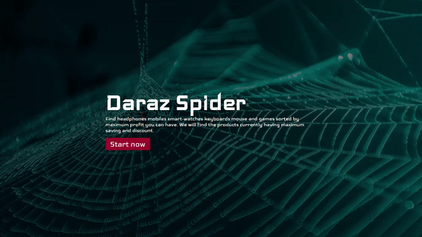
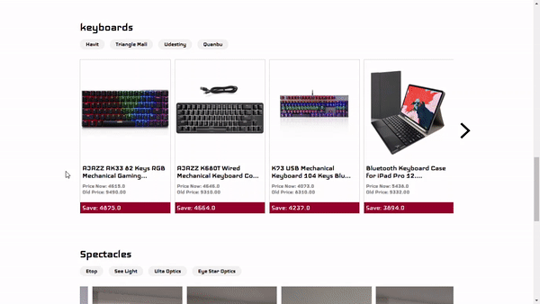

# Daraz-Spider-Django
#### Django web application to get the best deals from Daraz. By saying best deals, I have mention those products that have maximum reduce in price by time and shows Carousels of products.
#### Products: Headphones, Smart Watches, Keyborads, Mice and Spectacles.

## Landing page
#### Here it will take 20 - 40 seconds to scrap the website by makeing fake ajax calls.

## Home page
#### We will have 5 Carousels for five different types of product. And by using tags we will be able to grap more products.

## Product by brand
#### Every Carousels has some tags bellow the section headings (e.g. Headphones) and we can get more products by using those tags.
#### These tags are basicall brands and dealers.

## NOTE: It's done only for Educational purpose and has used publicly available data. 
